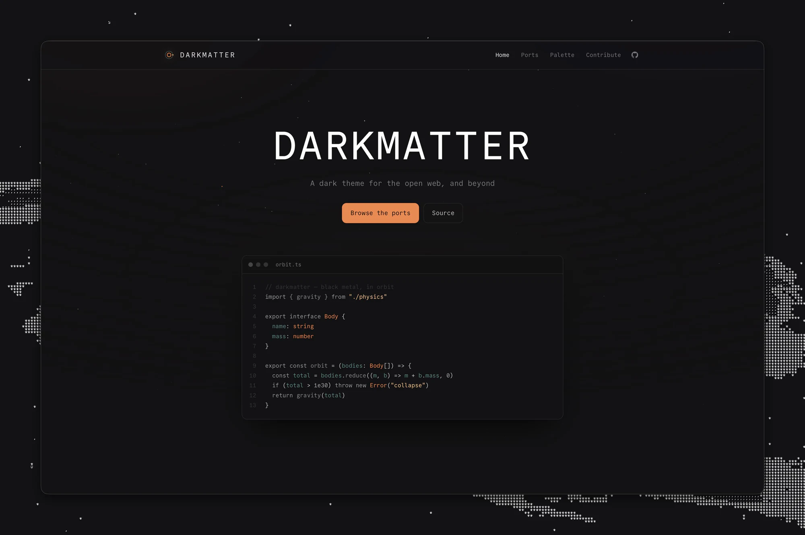

<h3 align="center">
	<br/>
	
	darkmatter-theme
	
</h3>

<p align="center">
	
</p>

The site for [DARKMATTER](https://github.com/darkmattertheme) — a dark
theme based on [Black Metal Bathory](https://github.com/metalelf0/base16-black-metal-scheme).

## Structure

```text
src/
├── components/     Starfield, Nav, Footer, PortCard, Palette, CodePreview
├── data/
│   ├── palette.ts  the 16 base16 slots + the ANSI mapping
│   └── ports.ts    loads ports.json from darkmattertheme/darkmatter
├── layouts/        Layout.astro (meta, starfield, chrome)
├── pages/
│   ├── index.astro      landing page
│   ├── ports.astro      all ports, filterable by category
│   ├── palette.astro    the palette and ANSI mapping
│   └── contribute.astro how to help and make a port
└── styles/
    └── global.css  palette as CSS custom properties + primitives
```

## Ports

The port list isn't in this repo. It lives in
[`ports.json`](https://github.com/darkmattertheme/darkmatter/blob/main/ports.json)
in the core repo, and `src/data/ports.ts` fetches it at build time. To add a
port, follow the
[contributing guide](https://github.com/darkmattertheme/darkmatter/blob/main/CONTRIBUTING.md).

To work against a local copy, point `DARKMATTER_PORTS` at it:

```sh
DARKMATTER_PORTS=../darkmatter/ports.json bun dev
```

A port's `icon` has to match one in `src/icons/`, wired up in
`src/components/PortCard.astro`. To add an icon, put the file in `src/icons/`,
add its name to the `PortIcon` union in `src/data/ports.ts` and to the `glyphs`
or `images` map in `PortCard.astro`. Ports without an icon get a terminal glyph.

## Commands

| Command        | Action                                |
| :------------- | :------------------------------------ |
| `bun install`  | Install dependencies                  |
| `bun dev`      | Dev server at `localhost:4321`        |
| `bun build`    | Build to `./dist/`                    |
| `bun preview`  | Preview the build                     |
